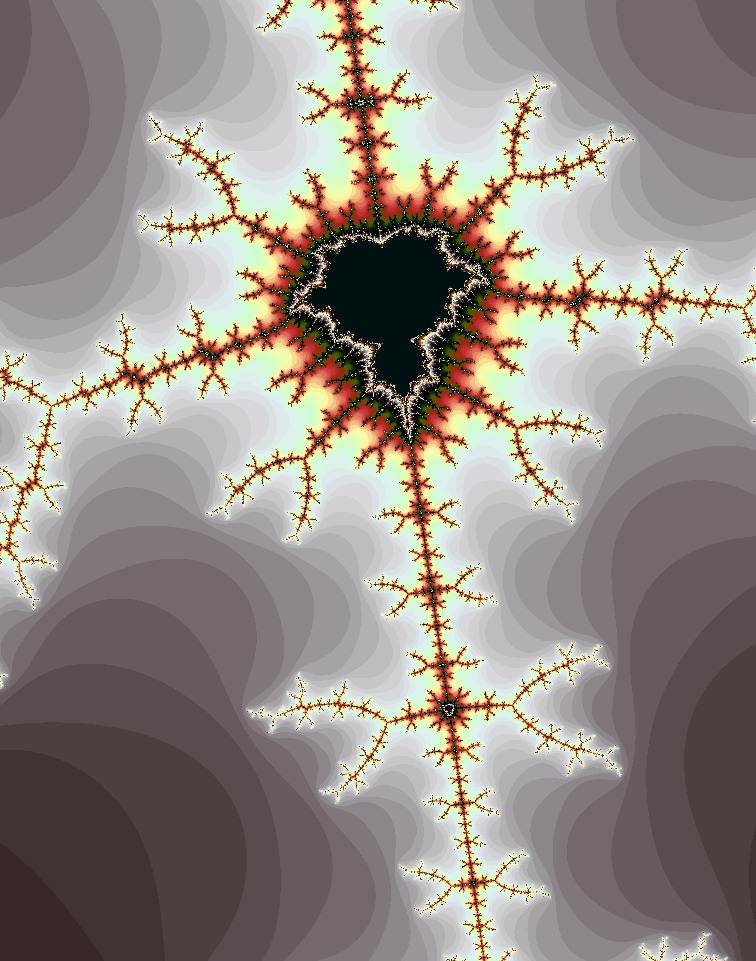
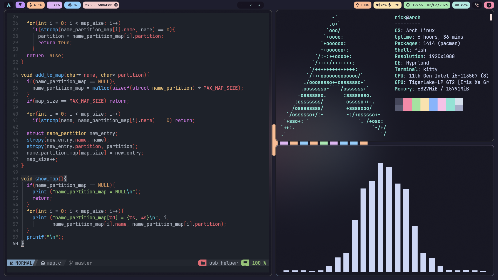
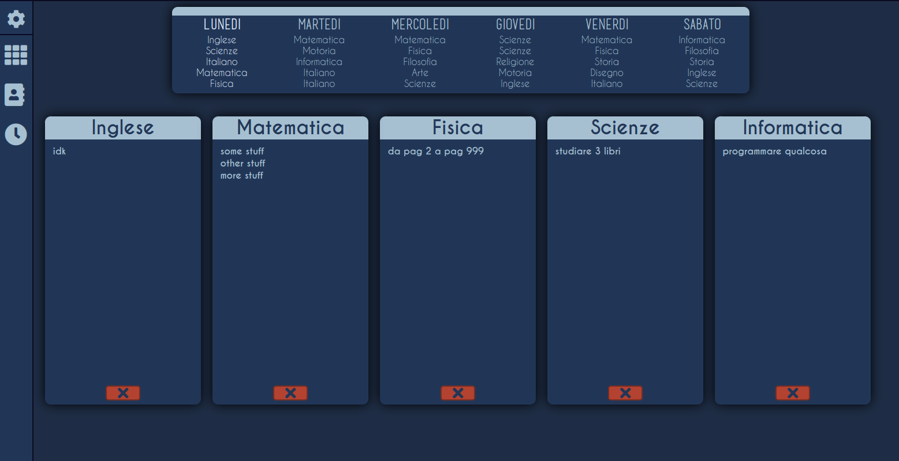

# About me

Computer Science Graduate  
Cybersecurity  
From Italy

### 🧩 Programming Languages

### 🧰 Tools

### ⚔️ Skills

### 📊 GitHub Stats

<table>
  <tr>
    <td>
      
    </td>
    <td>
      
    </td>
  </tr>
</table>

---
 

### Prevews

 
from mandelbrot2

 
from dotfiles

 
from Note-app

